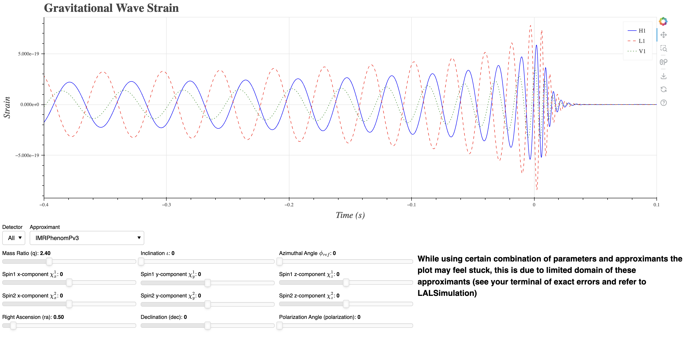

# Gstrain
An interactive Gravitational Wave strain plotter using Bokeh and PyCBC.

# Usage
To use Gstrain, install the required packages by running the following command:
```bash
pip install -r requirements.txt
```
Then you can run the following command to start the Bokeh server:
```bash
bokeh serve --show gw.py
```


# To Do
- [ ] Deploy it somewhere (for free)

Inspired by Akshay Khadse's [interactivegw](https://interactivegw.com/)